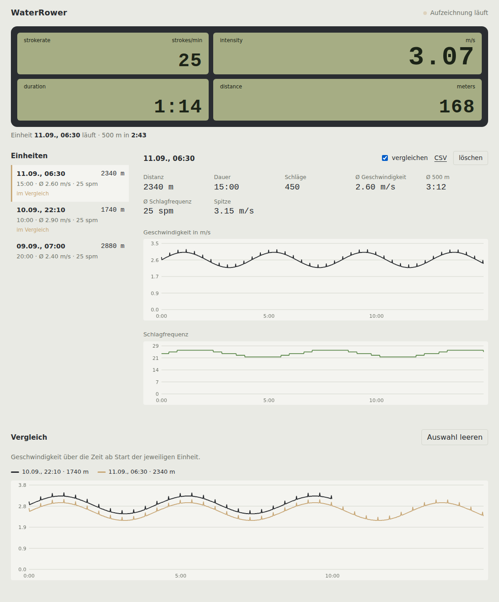
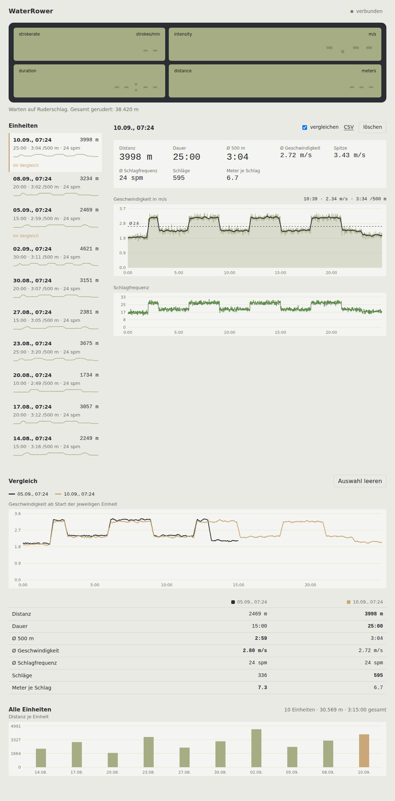

# waterrower-mqtt

Reads out a WaterRower Series IV Performance Monitor over USB and makes the
values available in Home Assistant, via MQTT, and through a local web UI.
No computer needed at the rowing machine – an ESP32-S3 for under €10 takes
on the role of USB host. Several rowers can point their trackers at one
shared server and race each other live.

```
WaterRower S4 ──USB──► ESP32-S3 (ESPHome) ──MQTT──► broker ──► Tracker (Docker, web UI)
                            │                                     │
                            ├── native API ──► Home Assistant     └── WebSocket ──► Arena
                            └── local web UI                          (shared server,
                                                                       live racing)
```

| Live | History & comparison |
|---|---|
|  |  |

## Components

The project is split into independent components, one folder each. The
firmware is the only mandatory part; everything else consumes what it
publishes over MQTT or the Home Assistant API.

### Firmware – `esphome/`

The ESPHome configuration for the ESP32-S3 that sits at the rowing
machine. It is the USB host for the S4 monitor, speaks the S4's serial
protocol, detects sessions, and publishes everything twice: as Home
Assistant entities over ESPHome's native API and as MQTT topics for the
other components. Compiled and flashed with the ESPHome dashboard (or the
CLI); the ESP then runs on its own.

| File | Purpose |
|---|---|
| `waterrower.yaml` | The complete firmware: USB handling, protocol parsing, session logic, entities, MQTT |
| `secrets.yaml.example` | Template for `secrets.yaml` (Wi-Fi and MQTT credentials, never committed) |

### Tracker – `docker/`

The **WaterRower Workout Tracker**: a self-contained web app that turns
the MQTT stream into a training log.
It subscribes to the broker, stores every session with one sample per
second in SQLite, and serves a web UI with the live display, per-session
charts, session comparison, CSV export and an "End session" button. Runs
as a single container from a prebuilt image; needs nothing but a
reachable MQTT broker. Home Assistant is not required for it.

| File | Purpose |
|---|---|
| `docker-compose.yml` | The rower's stack: the tracker, with a broker to uncomment if there is none in the house |
| `mosquitto/config/mosquitto.conf` | The broker's configuration, for the commented-out Mosquitto block |
| `*.build.yml` | Develop: overrides that build the images from the checkout |
| `Dockerfile`, `requirements.txt` | Image definition (Python 3.12, FastAPI, paho-mqtt) |
| `app/main.py` | HTTP API, Server-Sent Events stream, static files |
| `app/mqtt_ingest.py` | MQTT client, live state, session ingestion |
| `app/db.py` | SQLite schema and queries |
| `app/static/` | The UI: `index.html`, `app.js` (charts, i18n), `style.css` |

### Arena – `server/`

Optional, and the only part that is not local: a small server that several
trackers report to, so a group of friends with their own rowing machines
shares one training log and can race each other live. Each tracker keeps
recording exactly as before and additionally pushes its samples over one
outbound WebSocket – no port forwarding at anybody's home, and the arena
never talks to an ESP directly.

| File | Purpose |
|---|---|
| `../docker-compose.yml` | The host's stack – tracker, arena and tunnel – lives at the repository root |
| `Dockerfile`, `requirements.txt` | Image definition (Python 3.12, FastAPI) |
| `app/main.py` | App assembly, the two WebSocket endpoints, static files |
| `app/ingest.py` | The uplink endpoint: one socket per tracker |
| `app/race.py` | The race engine: lobby, countdown, lanes, placing |
| `app/records.py` | Personal bests, scanned out of the samples |
| `app/hub.py` | Live state and the fan-out to browsers |
| `app/api.py`, `app/auth.py`, `app/db.py`, `app/config.py` | REST API, sign-in, SQLite, settings |
| `app/static/` | The UI: arena, race, sessions, records, account |

### Home Assistant – `homeassistant/`

Optional. Home Assistant is the natural home for the ESPHome dashboard
and typically also runs the MQTT broker (Mosquitto App), but the firmware
works with any broker. `dashboard.yaml` is a ready-made dashboard for the
entities the firmware exposes: live tiles, session summary, history,
device controls.

### Shared

| Path | Purpose |
|---|---|
| `VERSION` | Project version, mirrored in the firmware's `substitutions.version` (see [Versioning](#versioning)) |
| `.github/workflows/docker-publish.yml` | Builds and publishes the tracker and arena images on every push |
| `case/` | 3D-printable case for the ESP, with cable strain relief, for the back of the S4 or the frame (CC BY-SA 4.0, see [Case](#case)) |
| `docs/` | Screenshots used in this README |

### How they fit together

```
                         ┌────────────────────────────────────────────┐
                         │  Home Assistant (optional)                 │
 S4 ──USB──► ESP32-S3 ───┤  native API → entities, dashboard.yaml     │
             esphome/    │  Mosquitto App → MQTT broker               │
                 │       └────────────────────────────────────────────┘
                 └──MQTT──► broker ──► Tracker (docker/)  web UI :8080
                                             │
                                             │ WebSocket (outbound, TLS)
                                             ▼
                               Cloudflare Tunnel → Arena (server/)
                                             ▲
                        the same from your friends' houses
```

The ESP publishes; the broker distributes; the tracker and Home
Assistant each consume independently. The only channel back to the ESP
is `waterrower/cmd/end_session`, used by the tracker's button – and, when
a race is about to start, by the arena through the tracker's uplink, so
every monitor is zeroed before the gun.

## Setup order

The detailed steps are in the sections below; this is the order that
avoids backtracking.

1. **Home Assistant groundwork** – install the ESPHome Device Builder and
   the Mosquitto broker Apps (Settings → Apps) and create an MQTT user for
   the ESP. Any other MQTT broker works too; only the dashboard needs HA
   itself.
2. **Solder bridge** – close the USB-OTG bridge on the ESP32-S3 board
   ([Hardware](#hardware)) before it ever meets the S4. Flashing doesn't
   need it, the S4 does.
3. **Firmware** – add `esphome/waterrower.yaml` in the Device Builder,
   fill in `secrets.yaml`, put your HA address into `allowed_origins`,
   flash once over the COM port ([Firmware](#firmware)). HA discovers the
   device; adopt it and assign an area.
4. **Connect the S4** – ESP "USB" port → adapter → S4 cable. The ESPHome
   log shows `S4 link up` and the entities fill in. Pull a few strokes to
   see a session start.
5. **Home Assistant dashboard** – import `homeassistant/dashboard.yaml`
   ([Home Assistant dashboard](#home-assistant-dashboard)).
6. **Tracker** – deploy `docker/docker-compose.yml` on your Docker host
   (e.g. as a Dockge stack), set `TZ` and either the `MQTT_*` values or
   use the settings form, open `http://<host>:8080/`
   ([Tracker](#tracker-docker)). The footer shows the tracker and
   firmware versions once MQTT is flowing.
7. **Row** – a session starts on the first stroke; end it with the
   tracker's "End session" button, or "End & zero" if you also want the
   monitor back at zero (the HA reset button does the latter).
8. **Arena** – only if you want to row against other people: deploy
   `docker-compose.yml` from the repository root once, create an athlete per person, and
   paste each one's token into their tracker ([Arena](#arena-multiplayer)).

## Hardware

| Part | Note |
|---|---|
| ESP32-S3-DevKitC-1 (clone, N16R8) | Two USB-C ports: **COM** (UART, flashing/power) and **USB** (native OTG port). The exact board used: [ESP32-S3-WROOM-1 N16R8 DevKitC-1 on amazon.de](https://www.amazon.de/dp/B0FYFF8CB2/) – any DevKitC-1 clone with two USB-C ports and the USB-OTG solder bridge should do |
| WaterRower S4 Performance Monitor | Battery-powered (self-powered), USB Mini port |
| USB-C-to-Mini-USB adapter | Between a USB-C cable and the S4's Mini-USB socket. The one used: [4x USB-C female to Mini-USB male on amazon.de](https://www.amazon.de/dp/B0G4BYT22N) – replaces the S4's supplied cable, and USB-C is what everyone has lying around now |
| USB-C cable | From the ESP's **USB** port to that adapter |
| USB power supply | On the **COM** port |

### The USB-OTG solder bridge

On the underside of the DevKitC-1 clone there's a solder bridge labeled
**USB-OTG**. It's open by default and must be **closed**. It ties the VBUS
lines of both USB-C ports together: only then does the "USB" port carry the
5V the S4 needs to detect a host at all. The S4 draws virtually no power
through it – it runs off its own batteries.

**Important:** Once the bridge is closed, never connect both ports to
separate power sources at the same time.

### Wiring

```
USB power supply ──► [COM]  ESP32-S3  [USB] ──USB-C──► C-to-Mini adapter ──► S4
                                       ▲
                              (USB-OTG solder bridge closed)
```

A USB-C-to-USB-A adapter plus the S4's own cable works just as well; the
Mini-USB adapter simply saves a link in the chain, and nobody has USB-A
cables any more.

### Case

`case/` has a printable case for the board: a remix of
[peaberry's ESP32-S3 DevKitC-1 case](https://www.thingiverse.com/thing:7284377)
with a cable plinth in front of the ports – one zip tie holds both cables
there, so a pull never reaches the sockets – and the ports marked on the
lid. It prints without supports.

Mount it on the back of the S4 with Velcro or Dual Lock: the ESP then
moves with the monitor, so tilting it never flexes the cable at the S4's
fragile Mini-USB socket. The default bottom has a flat underside for that;
a variant with zip-tie ears is there for strapping it to the frame instead.
Details in [case/README.md](case/README.md).

## Firmware

ESPHome ≥ 2026.4 with the ESP-IDF framework. ESPHome's `usb_uart` component
exposes the S4 as a generic CDC-ACM device on a `uart:` interface; the USB
host stack comes from ESPHome, and the protocol parsing lives in lambdas in
the YAML.

### Initial setup

1. Copy `esphome/secrets.yaml.example` to `esphome/secrets.yaml` and fill
   it in.
2. In `esphome/waterrower.yaml`, under `web_server.allowed_origins`, enter
   the address of your Home Assistant instance – or delete the key if you
   have none.
3. First flash over the **COM** port. If no serial port shows up: hold
   BOOT, plug in the cable, release BOOT.
4. After that everything runs over OTA – no cable needed anymore.

#### Flashing without Home Assistant

The ESPHome Device Builder is an add-on, not a requirement. The same
configuration compiles from the command line, and the ESP does not care
which of the two built it:

```bash
pip install esphome
```

```bash
cd esphome && esphome run waterrower.yaml
```

`run` compiles, asks which serial port to use, flashes, and then shows the
log – the same log the dashboard shows, which is where `S4 link up`
appears. Later changes go over the air from the same folder; pick the
device's address instead of a port when it asks.

Two things to know when going this way:

- Without Home Assistant the `api:` block has nothing to talk to. Leave it
  in – it is harmless and costs nothing – or delete it along with
  `web_server.allowed_origins`. Everything the tracker and the arena need
  travels over MQTT, which is independent of it.
- The first compile pulls a toolchain and takes a few minutes. After that
  it is seconds.

Docker instead of a local Python, if you prefer:

```bash
docker run --rm -it --device=/dev/ttyUSB0 -v "$PWD:/config" ghcr.io/esphome/esphome run waterrower.yaml
```

And if you want no toolchain at all: the web flasher at
[web.esphome.io](https://web.esphome.io) flashes a `.bin` over the browser
(Chrome or Edge), but somebody has to compile that `.bin` first – so this
is the way to put a finished firmware on the *second* and *third* machine,
not the way to build it.

#### From the browser, next to the tracker

There is a third way that needs no command line at all. Uncomment the
`esphome` block in whichever compose file you deployed and open
`http://<host>:6052/`: that is the ESPHome dashboard, which edits the YAML,
compiles it and flashes over the air.

The configuration is already there. The **Firmware** card in the tracker's
settings panel writes one into the folder the dashboard reads – both
containers share `./esphome-data`. Pick one from the list, press *Ins
ESPHome-Verzeichnis*, add your own `secrets.yaml` next to it in that
folder, and the dashboard has everything it needs. The same card downloads
the YAML if you would rather handle the file yourself, and takes one of
your own if you have changed it.

The list holds up to three kinds:

- **mitgeliefert** – the YAML this tracker image was built with. It matches
  the running tracker exactly and needs no network. This is the one to take
  unless you have a reason not to.
- **neueste von GitHub** – fetched from the default branch when you press
  the button, never in the background and never on a timer. Use it to pick
  up a firmware change without waiting for a tracker release. What comes
  back has to arrive over HTTPS, stay under half a megabyte and look like
  an ESPHome configuration, or nothing is written: this ends up burned onto
  hardware, so a redirect to a login page is not something to save. Point
  `FIRMWARE_YAML_URL` elsewhere if you keep your own fork.
- **im Ordner** – whatever is already in `./esphome-data`, with the version
  it declares, so you can reinstall or copy one under another name.

The card also shows which firmware version the ESP reports against the one
this tracker shipped with. A difference is not an error – running last
month's firmware on purpose is normal – but it explains a field that is
missing.

The tracker compiles nothing itself, and that is deliberate: it would need
PlatformIO and an ESP32 toolchain in the one container whose job is to keep
recording, and a build competing with the MQTT thread for memory is a bad
trade for something the dashboard already does well.

### What the firmware does

- Keeps the USB link up: when the S4 appears it sends the `USB` command
  (without it the S4 stays silent) and repeats the handshake if packets
  stop for 10 s. "S4 Connected" and "USB Mode" report the link state.
  Note that the S4 runs off USB power here and therefore never switches
  itself off – see [Troubleshooting](#troubleshooting).
- Polls the S4's memory addresses every second during a workout. While
  idle it sends nothing at all – every packet the S4 receives resets its
  auto power-off timer, so the monitor still switches itself off as usual.
- Detects session start on the first stroke. A session ends when the
  tracker's "End session" button sends `waterrower/cmd/end_session`, or as
  a safety net after a configurable time without stroke or paddle packets
  from the S4 (default 5 min, "Session Timeout" in Home
  Assistant – the speed register isn't used for this, it keeps its last
  value after you stop). Each session gets an ID that's a local timestamp
  (SNTP), in the zone named by the `timezone:` substitution at the top of
  the YAML. Name it explicitly: left out, ESPHome quietly takes the
  timezone of whatever machine compiled the firmware, and a container or a
  CI runner is UTC – every workout then lands two hours out in summer.
- Shows 0 for speed, stroke rate and watts as soon as the S4 reports no
  rowing (its `PING`) – the monitor itself keeps displaying the last
  stroke's values.
- Publishes every value individually over MQTT, plus bundled as JSON on
  `waterrower/live` (with the session ID in the payload). At session end a
  retained summary goes out on `waterrower/session/last`.
- Entities and MQTT topics are published event-driven: once per second
  during a workout, once after the handshake, when the S4 goes idle and
  after a session ends or a reset. While idle nothing is sent and the log
  stays quiet; a lost link is logged once, not every retry.
- Serves a local web UI at `http://esphome-waterrower.local/`, grouped
  into Live, Session, Control and Diagnostics instead of one long
  alphabetical list.

### Home Assistant dashboard

`homeassistant/dashboard.yaml` is a ready-made sections dashboard: live
tiles, session summary, a 24 h history graph, and the device controls
(session timeout, end-session/reset button, versions). Import it via
Settings → Dashboards → Add dashboard, then paste it into the raw
configuration editor. The entity IDs assume the device is called
"WaterRower" (`sensor.waterrower_…`); if Home Assistant gave your device
a different prefix, search & replace `waterrower_` first.

## Protocol

Based on WaterRower's document **"Water Rower S4 & S5 USB Protocol, Issue
1.04"**. It isn't included here because its redistribution terms are unclear,
but searching for the exact title finds it quickly. Summary:

- Serial CDC connection, 19200 baud, ASCII, lines end with `\r\n`
- `USB` opens the connection, response `_WR_`
- `IRS xxx` / `IRD xxx` / `IRT xxx` read 1 / 2 / 3 bytes starting at address
  `xxx`
- Responses `IDS` / `IDD` / `IDT` return the bytes **high byte first**
- `SS` / `SE` = stroke start / end, `Pxx` = paddle pulses per 25 ms, `PING`
  every second while idle
- Send at most one packet per 25 ms

### Addresses used

| Address | Register per spec | Meaning | Status |
|---|---|---|---|
| `057`/`058` | distance_low/hi | Displayed distance (m) | confirmed |
| `14A`/`14B` | m_s_low/hi_average | Speed (cm/s), matches the display | confirmed |
| `1A9` | zone_sr_val | Stroke rate | confirmed |
| `1E1`–`1E3` | display_sec/min/hr | Time, **BCD-encoded** | confirmed |
| `140`/`141` | strokes_cnt_low/hi | Stroke count | plausible |
| `142`/`143` | stroke_average / stroke_pull | Stroke timings in 25 ms steps | unverified |
| `081`/`082` | total_dis_low/hi | Lifetime distance | unverified |
| `088`/`089` | kcal_watts_low/hi | Watts | **scaling unverified** |
| `1A0` | zone_hr_val | Heart rate (chest strap only) | commented out |

Pitfalls that cost us time:

- `148`/`149` (`m_s_*_total`) doesn't return the display value, `14A`/`14B`
  does.
- `14C` is a counter, not a speed.
- The time registers are BCD: `0x13` means 13, not 19.

## MQTT topics

| Topic | Content |
|---|---|
| `waterrower/distance` | Distance in m |
| `waterrower/speed` | Speed in m/s |
| `waterrower/stroke_rate` | Stroke rate |
| `waterrower/strokes` | Stroke count |
| `waterrower/ratio` | Pull/recovery ratio |
| `waterrower/duration` | Duration in s |
| `waterrower/watts` | Watts |
| `waterrower/total_distance` | Lifetime distance in m |
| `waterrower/split_500m` | 500m split as `m:ss` |
| `waterrower/split_500m_s` | 500m split in seconds (numeric, for graphs) |
| `waterrower/session_active` | `ON` / `OFF` |
| `waterrower/session_id` | Current session ID |
| `waterrower/live` | All values as JSON, 1×/s during a workout |
| `waterrower/session/last` | Summary of the last session (retained) |
| `waterrower/s4_connected` | `ON` / `OFF` – the S4 is switched on and enumerated on USB (retained) |
| `waterrower/usb_mode` | `ON` / `OFF` – the S4 is in USB mode and streaming (retained) |
| `waterrower/firmware_version` | Firmware version (retained) |
| `waterrower/cmd/end_session` | **To** the ESP: end the running session; payload `reset` also resets the monitor |

## Tracker (Docker)

Standalone recording and analysis, no InfluxDB or Grafana required. One
container, SQLite for storage, a web UI with no external dependencies. The
only requirement is a reachable MQTT broker.

### Deploy

The image is published to GitHub Container Registry for `linux/amd64` and
`linux/arm64` (Raspberry Pi 4/5 etc.) by `.github/workflows/docker-publish.yml`
on every push to `master`.

`docker/docker-compose.yml` pulls that image – it's the only file a host
needs (e.g. as a Dockge or Portainer stack), no checkout, no build:

```bash
cd docker
docker compose up -d
```

Then open `http://<host>:8080/`. On first visit, a form for the broker
connection (address, port, login, topic prefix) opens; settings are saved to
`./data/settings.json` and can be changed anytime via the status indicator
in the top right. Alternatively pre-fill the `MQTT_*` variables in the
compose file. The database lives at `./data/waterrower.db`.

Set `TZ` in the compose file to the ESP's time zone – session IDs are local
timestamps, and the tracker uses `TZ` to turn them into the start times
shown in the UI. The firmware's `timezone:` substitution has to say the
same thing: the two read the same timestamps, so a mismatch shifts every
workout by the difference between them.

### Without Home Assistant

The firmware needs a broker, not Home Assistant. If there is no HA in the
house, uncomment the `mosquitto` block at the bottom of the compose file –
it is in both of them, and the header of either has the whole recipe.

Mosquitto 2 listens on nothing and admits nobody until told, which is the
right default and the reason `mosquitto/config/mosquitto.conf` ships with
the repository. Create the password file it points at – the ESP and the
tracker both sign in with it:

```bash
cd docker && mkdir -p mosquitto/config mosquitto/data
```

```bash
docker run --rm -v "$PWD/mosquitto/config:/mosquitto/config" eclipse-mosquitto:2 mosquitto_passwd -c -b /mosquitto/config/passwd waterrower DEIN-PASSWORT
```

Put that same password in a `.env` as `MQTT_PASSWORD` and leave `MQTT_HOST`
at `mosquitto` – the container name, they share the stack's network. In the
ESP's `secrets.yaml`, point `mqtt_broker` at the host's address and use the
same user and password.

Port 1883 has to be published – the ESP is on the network, not in the
stack – but it belongs on the LAN. Do not forward it from the router: the
arena needs no access to your broker, the tracker pushes to it from the
inside.

### Develop

`docker/docker-compose.build.yml` builds the image from source instead:

```bash
cd docker
docker compose -f docker-compose.build.yml up -d --build
```

### What the tracker does

- Shows live values laid out like the S4 display, plus whether the
  ergometer is off, on, or linked to the ESP (header, next to the broker
  status)
- Stores every session from `waterrower/live` (1 sample per second) and
  picks up the summary from `waterrower/session/last`
- Lists all sessions, shows speed and stroke-rate history, compares up to
  four sessions overlaid
- Two session buttons: "End session" closes the running session on the ESP
  and leaves the display to be read, "End & zero" also sets the monitor
  back to zero. The arena shows the same pair with the same words
- CSV and Excel export per session (the workbook has a summary sheet, all
  samples and a speed/stroke-rate chart), plus one workbook across all
  sessions with totals and a distance chart
- Per-session delete
- Light/dark switch in the header (Auto follows the system); the chart
  colours are a colourblind-safe categorical set, checked against both
  surfaces
- Optional uplink to an [Arena](#arena-multiplayer) server: the same
  samples go out over one WebSocket, sessions recorded while the uplink
  was down are sent afterwards, and the arena may ask for a monitor reset
  before a race

If the tracker is started after the ESP, the samples from before are
missing – but the session ID carries the start time, so ordering stays
correct.

### API

For your own analysis:

| Path | Content |
|---|---|
| `GET` / `POST /api/settings` | Read / set broker settings (reconnects) |
| `GET` / `POST /api/arena` | Read / set the arena uplink (address, token, on/off) |
| `GET /api/version` | Tracker version and git commit |
| `GET /api/live` | Current state |
| `GET /api/stream` | Live updates as Server-Sent Events |
| `POST /api/session/end` | Close the running session, monitor keeps its display (publishes `cmd/end_session` = `end`) |
| `POST /api/session/reset` | Close it and zero the monitor (publishes `cmd/end_session` = `reset`) |
| `GET` / `POST /api/firmware` | Which firmware the ESP runs, the configurations on offer, and the dashboard address |
| `GET` / `POST /api/firmware/yaml` | Download a configuration, or write one into the ESPHome folder |
| `GET /api/sessions` | List of all sessions |
| `GET /api/sessions/{id}` | Session with all samples |
| `GET /api/sessions/{id}/export.csv` | Samples as CSV |
| `GET /api/sessions/{id}/export.xlsx` | Session as an Excel workbook |
| `GET /api/export.xlsx` | All sessions as one Excel workbook |
| `DELETE /api/sessions/{id}` | Delete a session |

The UI is available in English and German – the DE/EN toggle in the header
switches it; the default follows the browser language.

## Deployment shapes

Two files, because there are two things you can want.

| | File | Brings up |
|---|---|---|
| **Row alone** | `docker/docker-compose.yml` | tracker |
| **Row together** | `docker-compose.yml` (root) | tracker, arena, tunnel |

Rowing alone is the tracker and nothing else: it records, it charts, it
exports. Joining somebody else's arena is *also* this file - the uplink is
a setting in the form, not a different deployment - so a friend who gets an
invitation needs no second container and nothing from the other row.

Rowing together is what the root file sets up, for the one person who
provides the arena the others point at. The tracker is in it as its own
container, because it is what keeps recording while the arena is down for
an update, holds the second copy of the data, works with the internet out,
and does the Excel export.

Both files carry a Mosquitto block commented out at the bottom, for a house
with no broker - the firmware needs one, Home Assistant it does not.
Uncomment it, create its password file (the header of either file has the
command), and leave `MQTT_HOST` at `mosquitto`.

Each of the two has a `.build.yml` beside it – `docker-compose.build.yml`
at the root, `docker/docker-compose.build.yml` for the tracker alone. They
are not a third and fourth shape but overrides that build the images from
a checkout instead of pulling them. They are kept separate so the deployed
file stays copyable on its own: a `build:` block in it would point at
directories that are not next to it, and a failed pull would fall back to
building and die with "path not found" instead of saying what went wrong.

## Arena (multiplayer)

> **Real-world multiplayer untested.** The arena works end to end –
> sign-in, uplink, backfill, races, records, badges – and 234 automated
> checks say so (`tests/`), the uplink ones against a real tracker over a
> real WebSocket. What has never happened is the thing it was built for: two
> people, two WaterRowers, two houses, one race at the same moment. There
> is one ESP32-S3 among us, so nobody has been able to try. Expect the
> rough edges of a first outing.
>
> The firmware, the tracker's recording and the Home Assistant side are
> untouched by any of it: a tracker with the uplink switched off behaves
> exactly as it did before.

One server, a handful of friends with their own WaterRowers, one shared
training log – and races that happen at the same moment in different
houses. Everybody keeps their own tracker; the arena only ever sees a copy.

### How the data gets there

Each tracker opens **one outbound WebSocket** to the arena and
authenticates with a device token. That direction matters: nobody has to
forward a port, expose a broker, or own a certificate, and it works from
behind any consumer router. The arena speaks no MQTT at all.

The alternatives were considered and rejected: pointing the ESP straight at
a central broker costs everyone their local broker (ESPHome has one MQTT
client), and bridging each household's Mosquitto means every friend has to
edit a broker config.

Because the tracker is the one sending, it also knows what it has: on
connect the arena replies with the sessions it already holds, and the
tracker sends the rest. A weekend with the internet down costs a delay,
not the data.

### Deploy

The compose file at the repository root runs the arena, the tunnel that
publishes it, and the tracker alongside. Both images are published, so the
file is all you need - put it on the Docker host with a `.env` next to it
(see `.env.example`) carrying at least an admin password:

```
ARENA_ADMIN_PASSWORD=something-long
```

Then, from the folder holding that file:

```bash
docker compose up -d
```

Open `http://<host>:8090` and sign in as `admin`. The database lives at
`./data/arena.db`. Keep `ARENA_SECURE_COOKIES=0` while you are on plain
HTTP – a Secure cookie is dropped there and the sign-in would not stick.

The tunnel is part of the same stack, so it comes up with everything else:

1. In Cloudflare Zero Trust → Networks → Tunnels, create a tunnel and put
   its token in `.env` as `TUNNEL_TOKEN`.
2. Under the tunnel's **Public Hostname**, point your hostname (say
   `arena.example.com`) at `http://arena:8090` – the container name, since
   they share the stack's network. Cloudflare proxies WebSockets, which is
   what both the trackers and the browsers use.

The arena publishes no port of its own: cloudflared dials out, so nothing
is exposed on the host at all. To check it without the tunnel first, add a
`ports:` block to the arena service and set `ARENA_SECURE_COOKIES=0` while
you do – over plain HTTP a Secure cookie is dropped and the sign-in would
not stick. Take both back out afterwards: anything able to reach 8090
directly could claim any address in `X-Forwarded-For` and walk around every
lockout.

Working on the code instead of deploying it? Use the checkout and add the
override that builds from it:

```bash
docker compose -f docker-compose.yml -f docker-compose.build.yml up -d --build
```

Any other reverse proxy works as well – the app listens on `8090`, honours
`X-Forwarded-*`, and needs nothing but WebSocket pass-through.

That root compose file brings the tracker up alongside, which is how you
try the uplink end to end: mint a token in the arena and paste it into the
tracker with `http://arena:8090`, the container name. `--build` on it
builds both images from the checkout instead of pulling them.

### Adding your friends

The bootstrap `admin` account runs the arena; it does not row in it, and
it does not see the rowing either: an admin gets the account page and
nothing else – athletes, invitations, the security panel. No tiles, no
races, no sessions, no leaderboards, and no tracker token, because there is
no ergometer behind the account. **Make yourself an athlete account too**,
and keep `admin` for the administration.

Races are therefore created and started by whoever is rowing them. What an
admin can set up is **Vorlagen** – named races with a mode and a target,
which the athletes then pick with one tap instead of filling the form.
A fresh arena comes with a handful (2000 m, 500 m Sprint, 5000 m, 20
Minuten, frei rudern); delete them all and they stay deleted.

**Lost the admin password?** Set `ARENA_ADMIN_RESET=1` alongside a new
`ARENA_ADMIN_PASSWORD` in the compose file and restart: the account keeps
its history, the password is replaced and every open session of it is
ended. Take the variable out again afterwards, or every restart puts that
password back. Anyone who can edit the compose file can already read the
database, so this hands over nothing they did not have.

For everybody else there is **Passwort zurücksetzen** next to each athlete:
it clears the password, signs that account out everywhere, and hands you a
one-time link for them to set a new one. Nobody, admin included, ever gets
to type somebody else's password.

Under **Konto / Account**:

1. *Athlet anlegen* – a handle and a display name. You get a one-time
   invitation link; send it to them. They open it, pick a password, and
   are in. There is no public sign-up.
2. Each of them creates a token under **Tracker-Verbindung** (it is shown
   exactly once – it is stored hashed) and pastes it, with the arena's
   address, into their tracker under *Arena*. Within a few seconds the
   arena header shows them as online.

`ARENA_URL` and `ARENA_TOKEN` can pre-fill that form from the tracker's
compose file, exactly like the `MQTT_*` variables do: they are defaults,
and anything saved through the form lands in `data/settings.json` and wins
from then on. Pick one or the other rather than setting both.

The **Admin** checkbox beside each athlete moves the role around. The last
admin cannot give it up – somebody has to be able to hand it back. Promoting
someone takes them out of a lobby they are waiting in, but never out of a
race already being rowed.

Lane colours are handed out automatically and are used consistently for
that athlete – in the live tiles, the charts, the lanes and the tables.

### Locking out guessers

The arena is reachable from the internet, so guessing should not be free.
Three lockouts, all of them set in the arena under **Konto → Sicherheit**
and kept in the database:

| Policy | Counts | Default |
|---|---|---|
| Sign-in per address | one address guessing at any account | 10 failures, 15 min |
| Sign-in per account | one account guessed at from anywhere | 30 failures, 15 min |
| Invitations per address | wrong invitation codes from one address | 10 failures, 60 min |
| Tracker sign-in per address | a tracker offering a device token that is not one | 10 failures, 15 min |

Each is *that many failures, then locked out for that many minutes* – and
the same span is how long a failure is remembered, so somebody who stops
trying ages out on their own. A failure count of `0` switches that policy
off. The reply is a `429` with a `Retry-After`, and the sign-in form says
so rather than letting it read as a wrong password.

The per-account policy is the loose one on purpose: it is the one that
could be used to lock a friend out, so it should take some doing.

Below the settings is **Aktive Sperren** – who is locked out right now,
which policy caught them and how long is left, with a link to lift one and
a button to lift them all. That is the way back in after a fat-fingered
password, and how you see that somebody is hammering the door.

Under that, **Fehlversuche der letzten 24 Stunden**: every refused sign-in
and wrong invitation code with its time, the account that was tried and the
address it came from, plus which addresses and accounts were busiest. The
lockout counters live in memory and a restart forgets them, so this log is
the only part that survives one. It holds addresses, so it is pruned to a
week.

### What else the audit changed

- Stored password hashes now carry the parameters they were made with, so
  the cost can be raised later without invalidating anyone's password; the
  cost went from scrypt n=2^14 to n=2^16, and an old hash is replaced with
  a current one the next time that person signs in. OWASP's floor is 2^17,
  which is 128 MiB *per verification* - with FastAPI's forty-wide thread
  pool that is how you get an out-of-memory kill instead of a sign-in, so
  at most two hashes run at once and the number stays at 2^16.
- Signing in with a name that does not exist costs the same time as one
  that does; otherwise the response time says which accounts are real.
- `/api/health` answers yes or no and nothing else - no counts, no version,
  no exception text. `/api/version` moved behind the sign-in.
- Every response carries a content security policy that allows scripts,
  styles and connections from this origin only, plus `frame-ancestors
  'none'`, `nosniff` and `no-referrer`. Nothing the page needs comes from
  anywhere else, so the policy can be that strict - it is the second lock
  on cross-site scripting, behind rendering names as text.
- Request bodies over 1 MiB are refused, and the sign-in fields are length
  limited, so nothing oversized reaches the hash function.
- `ARENA_TRUSTED_PROXIES` decides whose `X-Forwarded-For` to believe
  (default: everyone, because the tunnel's address varies). **This is why
  the `ports:` block should go once the tunnel works**: anything that can
  reach port 8090 directly can put any address in that header and walk
  around every address-based lockout.

Passwords must be at least twelve characters and use three of the four
kinds – lower case, upper case, digits, anything else. Worth knowing what
that costs: `correct horse battery staple` is refused at twenty-eight
characters while `Passwort123!` is accepted at twelve, though the
passphrase is far harder to guess. Composition rules always trade that
away; three kinds rather than four at least leaves room for a passphrase
with a capital and a number in it. `ARENA_ADMIN_PASSWORD` is held to the
same standard, but only warned about – locking yourself out of the first
start would be worse.

The `ARENA_LOGIN_IP_LIMIT`, `ARENA_LOGIN_NAME_LIMIT`, `ARENA_INVITE_IP_LIMIT`
and `ARENA_UPLINK_IP_LIMIT` variables (and their `_MINUTES` counterparts) set
the starting values only; once an admin saves the form, the database wins.

The tracker policy is not about guessing: a device token is 256 bits, and
it is stored hashed, so a leaked database hands out nothing. It is there
because without it anyone can open sockets at the uplink all day for free.
What a *stolen* token can do is bounded - falsify one athlete's training
data, nothing else - and revoking it under Tracker-Verbindung ends that.

Changing a password ends every other session of that account. Display
names are rendered as text and never as markup, so a name like
`` shows up as those characters, including on the
invitation page, which is reachable before anyone signs in. Every database
query uses bound parameters.

Passwords are hashed with scrypt, device tokens and browser sessions are
stored as SHA-256 – but everything else about an athlete, their invitation
code included, sits in `./data/arena.db`. That file is the one thing worth
backing up, and the one thing worth not handing around.

### Racing

Three modes:

| Mode | Ends when | Winner |
|---|---|---|
| **Distance** | everybody has covered the target, or ten minutes after the first finisher | fastest time |
| **Time** | the clock runs out | most metres |
| **Free** | the host ends it | nobody – just row together |

A race is created in a lobby; the others join and say they are ready. When
the host starts it, the arena sends every participant's tracker a reset, so
each monitor and each S4 session starts from zero, and then counts down ten
seconds. From the gun the view shows one lane per rower with distance,
split, stroke rate, watts, the gap in metres *and* in seconds, and – in a
distance race – the projected time still to go.

While your own session is running, a strip of the S4's own readout - metres,
time, split, rate, watts - sits docked at the bottom of whichever tab you
are on, with the session buttons on it. The race view goes static the
moment the race is over, and that is exactly when you are rowing it out and
want to watch the numbers, so the readout cannot live on one tab.

It goes the other way too: while a race is on, the tracker at the machine
shows the countdown, then your place and the gap. The arena is on a phone
somewhere; the screen in front of the rower is the tracker. The race state
rides the uplink that is already open, so it costs no port, no second
login and nothing new at the house.

Crossing the line does not end your session – whether you are done is your
call, not the race's, and after a hard 2 km most people row it out for a
while. Two buttons close it when you say so, the same pair in the same
order on both screens, so it does not matter which one you reach for:

- **End session** closes the session and leaves the display alone, so the
  numbers are still there to be read while you row it out.
- **End & zero** closes it and sets the monitor back to zero, for when the
  next piece starts straight away.

Either only ever ends your own session.

Left alone, the S4 closes the session itself once it has been idle long
enough – ending it just means the summary, the averages and any personal
best land now rather than then. `ARENA_END_AT_FINISH=1` hands that decision
to the race instead and closes everybody's session at the finish.

A lane does not have to be a live person. **Ghost** adds any recorded
session as an opponent, replayed against the race clock: row against a
friend who is not at home, or against your own best.

Timing: the race clock is the server's, and a lane is placed on it by the
arrival time of its samples. Samples come once a second, so a finish time
is interpolated between the two that straddle the line. Transport latency –
tens of milliseconds, and much the same for everyone – is the accuracy
limit. This is a race between friends, not a timing gate.

Everything a race produces is kept: the placings, the linked sessions, and
a head-to-head tally of who has beaten whom.

### Badges

A tab of its own. Twelve to start with, four of them hidden - a hidden one
is a silhouette that says nothing about what it wants until you walk into
it. That is per viewer, not per arena: the first person to find one does
not spoil it for the other two.

| | Visible | |
|---|---|---|
| Erste Fahrt | ✓ | first recorded session |
| Zehntausend / Hunderttausend | ✓ | 10 km / 100 km in total |
| Halbe Stunde | ✓ | 30 minutes without stopping |
| Unter 2:00 | ✓ | 500 m under two minutes |
| 2 km unter 8:00 | ✓ | best 2 km under eight minutes |
| Erster Sieg / Dreimal in Folge | ✓ | one race won / three in a row |
| Frühaufsteher | hidden | a session started before eight in the morning |
| Nachtschicht | hidden | a session started after nine in the evening |
| Wochenstreak | hidden | seven days in a row |
| Fotofinish | hidden | a race won by under a second |

Every rule has the same shape - **a metric, a comparison, a threshold** -
and that is the whole vocabulary, which is what lets an admin add badges
from the arena without anybody writing code. The cost is real and worth
stating: a condition nobody anticipated cannot be expressed. A free text
field would only have looked like it could.

Checked on the server when a session closes and when a race ends, never in
the browser - a badge you can award yourself is not worth having. History
counts: a new badge is handed to whoever already qualifies, so nobody rows
their first hundred kilometres again for a badge invented today, and an
arena that backfilled a year of sessions gets its badges on the next start.

### Records and comparison

Personal bests are scanned out of the samples with a rolling window, so the
fastest 2 km *inside* a 6 km row counts too. Standard efforts are 500 m,
1 km, 2 km, 5 km and 10 km for time, and 5, 10, 20, 30 and 60 minutes for
distance. The session list spans every athlete, and up to four sessions –
from different people – can be overlaid on one chart.

### Settings

| Variable | Default | Meaning |
|---|---|---|
| `ARENA_ADMIN_USER` / `ARENA_ADMIN_PASSWORD` | `admin` / – | The first login, created only while that athlete does not exist |
| `ARENA_SECURE_COOKIES` | `1` | Keep at `1` behind Cloudflare; `0` only for `http://localhost` |
| `ARENA_SESSION_DAYS` | `30` | How long a browser stays signed in |
| `ARENA_COUNTDOWN` | `10` | Seconds between the start and the gun |
| `ARENA_END_AT_FINISH` | `0` | Let the finish close everybody's session instead of leaving it to each rower |
| `ARENA_FINISH_GRACE` | `600` | Seconds a distance race waits for stragglers after the winner |
| `DB_PATH` | `/data/arena.db` | SQLite file |

### Arena API

Everything needs a session cookie; the uplink uses its own token.

| Path | Content |
|---|---|
| `GET /api/health` | Liveness for the container healthcheck – no sign-in needed |
| `POST /api/login`, `/api/logout`, `/api/join` | Sign in, out, redeem an invitation |
| `GET /api/athletes`, `POST /api/athletes` | Athletes; creating one returns an invitation code (admin) |
| `POST /api/athletes/{id}/tokens` | Mint a device token – returned once, stored hashed |
| `GET /api/live` | Who is rowing right now, and the running race |
| `POST /api/session/end` | Close my own session, my monitor keeps its display |
| `POST /api/session/reset` | Close my own session and zero my monitor |
| `GET /api/sessions`, `/api/sessions/{id}` | All athletes' sessions, one with its samples |
| `GET /api/records`, `/api/totals`, `/api/h2h` | Leaderboards, totals, head to head |
| `GET /api/sessions/{id}/export.csv`, `.xlsx` | One session as CSV or an Excel workbook |
| `GET /api/export.xlsx` | Every athlete's sessions in one workbook, with a totals sheet |
| `GET /api/backup` | A consistent copy of `arena.db`, taken while it runs (admin) |
| `GET /api/achievements` | Badges, with hidden ones redacted for whoever has not earned them |
| `POST` / `DELETE /api/achievements` | Add or remove a badge (admin) |
| `GET` / `POST /api/security` | Lockout policies and who is locked out (admin) |
| `POST /api/security/unblock` | Lift one lockout, or all of them (admin) |
| `POST /api/race`, `/api/race/join`, `/api/race/ready`, `/api/race/ghost`, `/api/race/start`, `/api/race/finish` | Run a race |
| `GET /api/races` | Race history with placings |
| `WS /ws/live` | Live tiles and race ticks for a browser |
| `WS /ws/uplink` | A tracker's uplink (see `server/app/ingest.py` for the messages) |

## Versioning

One version number for the whole project, kept in two places that must
match: the `VERSION` file at the repo root and `substitutions.version` in
`esphome/waterrower.yaml`. Releases are tagged `v<version>` in git.

- **Tracker and arena**: the workflow builds both images from the same
  commit and stamps each with the version and the short commit hash
  (`APP_VERSION`, `GIT_COMMIT`); both are tagged `latest`, `<version>` and
  `sha-<commit>`. The tracker keeps the repository's own image name
  (`ghcr.io/<owner>/waterrower-mqtt`), the arena adds `/arena`. Both show
  in their web UI's footer and at `/api/version`.
- **Firmware**: the version appears in Home Assistant's device info, as
  the "Firmware Version" entity in the ESPHome web UI, and is published
  on `waterrower/firmware_version` so the tracker's footer can show it.
  The "ESPHome Version" entity adds the compile timestamp. The firmware is
  compiled in the ESPHome dashboard, where git isn't available – the
  version tag is the link to the commit.

## Troubleshooting

- **Sensors stay at 0, log shows no USB message:** The ESP32 doesn't see a
  device. Check the solder bridge (multimeter: ~5V on the VBUS pin of the
  "USB" port), check the adapter's data lines.
- **Device is detected but no responses:** Handshake is missing. The log
  should show a `_WR_` after `USB`.
- **Inspect raw data:** Set `usb_uart.channels.debug: true` in the YAML,
  then every packet shows up in the log as a byte sequence. The
  "S4 Raw Data" sensor shows the last parsed line.
- **OTA rollback detected:** The new firmware crashed on boot, ESPHome
  rolled back to the old one. Test the last change in isolation.
- **Session start times are off by a few hours:** `TZ` in the compose file
  doesn't match the ESP's time zone.
- **The monitor never switches itself off:** expected, and not fixable in
  firmware. Its 2-minute auto power-off only applies on battery. As soon
  as it sees 5 V on VBUS and is enumerated it behaves as if attached to a
  PC and runs from USB power. Measured both ways: leaving USB mode with
  `EXIT` and sending nothing at all for 10 minutes does not switch it
  off, and opening the USB-OTG bridge (no VBUS) stops it from
  enumerating at all – so "linked" and "powers itself off" are mutually
  exclusive. If you want it off between workouts, cut the ESP's power,
  e.g. with a smart plug.

## Tests

Three suites under `tests/`, no framework: the arena in-process, the
tracker's uplink against a real arena in a subprocess, and the tracker's
own HTTP API. `python tests/run_all.py` runs all three; `tests/README.md`
says what each one covers and what they deliberately leave alone.

## Open items

Arena (see the [note above](#arena-multiplayer)):

- The arena's own views inside the tracker – the standings and your own
  badges, read-only, over the uplink that is already open
- More than one race at a time, and a race that survives a restart of the
  server (today it is marked aborted on start-up)

Firmware and tracker:

- Verify the ratio and watts registers against the display
- Workout presets from Home Assistant (`WSI`/`WSU` commands)
- Switching the display unit (`DI` commands)
- HTML recreation of the S4 display for Home Assistant
- Workout history in HA (e.g. embed the tracker via iframe)
- Heart-rate sensing once a chest strap is acquired

## License

[MIT](LICENSE), except `case/`: it is a derivative of a CC BY-SA 4.0
design and stays under that licence ([case/LICENSE](case/LICENSE)).
