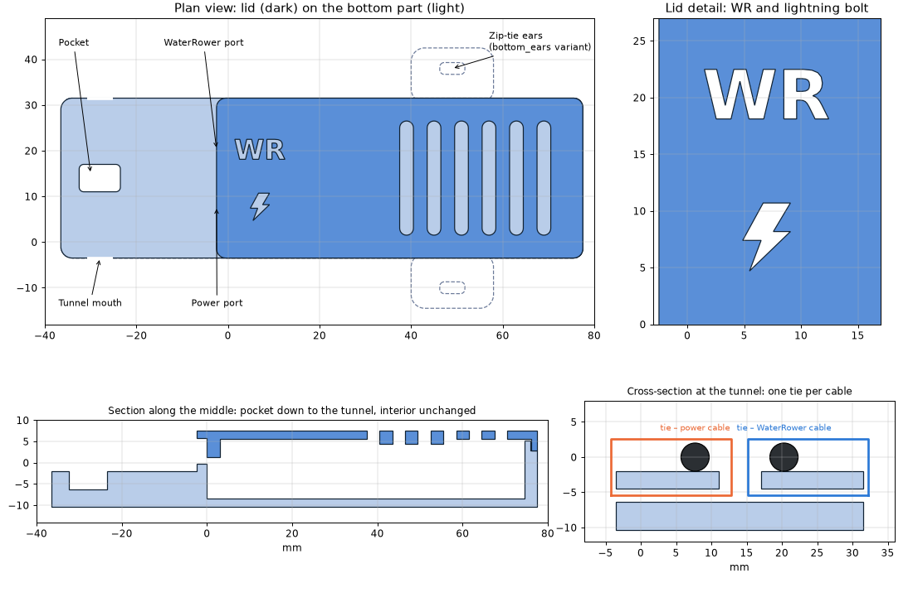

# ESP32 case

A 3D-printable case for the ESP32-S3-DevKitC-1 N16R8, made to sit on the
back of the S4 monitor.

It is a remix of
[ESP32-S3 DevKitC-1 Case by peaberry](https://www.thingiverse.com/thing:7284377),
licensed CC BY-SA 4.0. This folder is shared under the same licence –
unlike the rest of this repository, which is MIT. See [LICENSE](LICENSE).

| File | Part |
|---|---|
| `esp32case_bottom.stl` | Bottom with a flat underside, for Velcro or Dual Lock – ~28 g PLA, 114 × 35 × 16 mm |
| `esp32case_bottom_ears.stl` | The same bottom with zip-tie ears on both long sides – ~30 g PLA, 114 × 57 × 16 mm |
| `esp32case_lid.stl` | Lid, fits either bottom – ~7 g PLA |

## Where to mount it

On the back of the S4, with Velcro or 3M Dual Lock – that is what
`esp32case_bottom.stl` is for.

The reason is the Mini-USB socket on the S4, the most fragile part of the
whole setup. With the ESP on the fixed frame, every tilt or turn of the
monitor flexes the cable right at that socket. With the ESP on the monitor
they move together, and the data cable never carries a load. Only the
power cable moves then, and the plinth takes care of that.

- Keep the S4's battery compartment clear, so the batteries can still be
  changed without pulling the ESP off.
- Velcro or Dual Lock rather than foam tape, so the ESP comes off for
  flashing or opening.
- On a strongly curved surface a narrow strip along the case holds better
  than a large pad.

Mounting on the frame instead? `esp32case_bottom_ears.stl` has zip-tie ears
for strapping it to a strut or tube.

## Changes to the original

**Bottom**
- Side hole for the external antenna closed.
- Cable plinth in front of the two USB-C ports, 34 mm long, its top just
  below the plug housings. A zip-tie tunnel runs across it, split by an
  open pocket between the two cables, so each cable gets its own tie.
- `_ears` variant only: zip-tie ears on both long sides, flush with the
  underside.
- Repaired: the original STL had one back-to-back duplicate triangle (a
  zero-thickness fin), so it was not a closed solid.

**Lid**
- RST/BOOT button holes closed.
- **WR** engraved over the port that goes to the WaterRower monitor and a
  lightning bolt over the power port, 0.6 mm deep.

## Printing

- **Bottom:** floor on the bed, like the original. The plinth (and the
  ears) sit flush with the underside, the tie tunnel bridges 5.6 mm. No
  supports.
- **Lid:** top face down on the bed, like the original (its lip points
  up). The engraving then forms in the first layers and comes out crisp.

## Zip ties

- Up to ~5 mm wide: tunnel 5.6 × 1.8 mm, ear slots 5.5 × 2.6 mm.
- **Strain relief, one tie per cable:** push the tie into the tunnel from
  the outer side of the plinth, let it come up in the pocket between the
  cables, and close it over its own cable. Do the same from the other side
  for the second cable. Each cable is held on the plinth past its plug
  housing, so a pull does not reach the ESP's sockets, and either cable can
  be swapped without touching the other.
- Tunnel 5.6 × 1.8 mm under a 2.5 mm roof, pocket 6 × 9 mm.
- **Ears** (`_ears` variant): a tie through each ear around a strut or
  tube. One tie through both ears crosses the lid, which is fine.

With RST and BOOT covered, flashing over USB with BOOT held – only needed
if an OTA update ever leaves the ESP unbootable – means opening the case.
